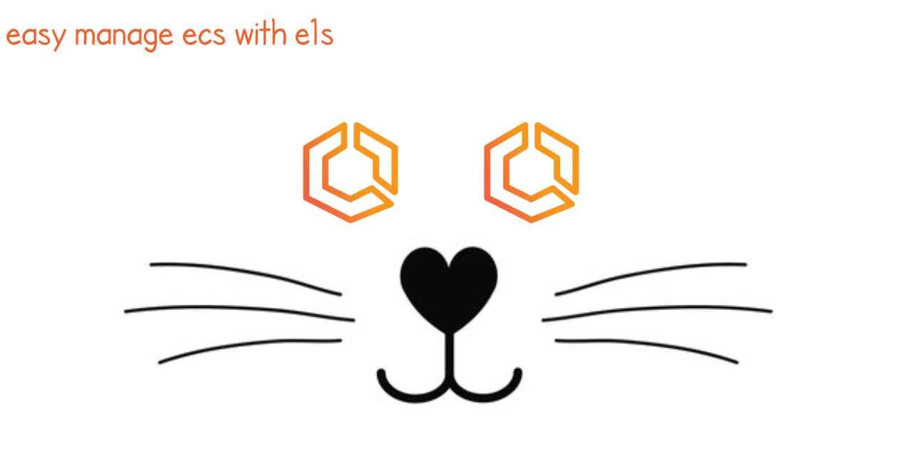
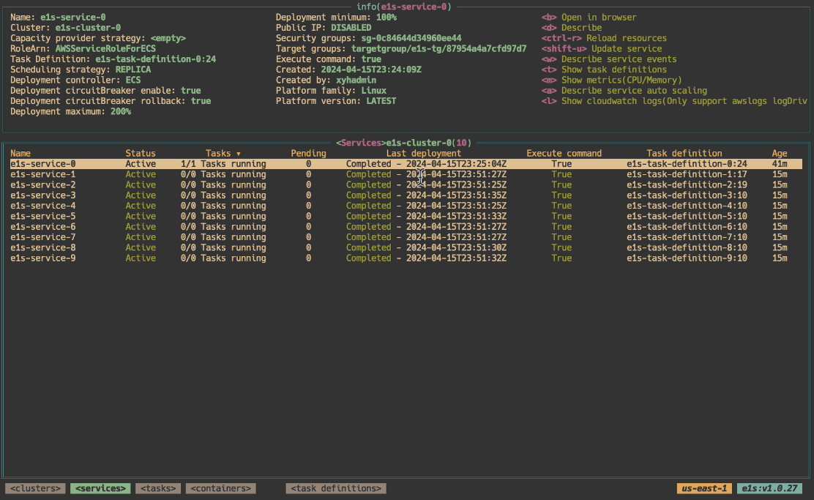
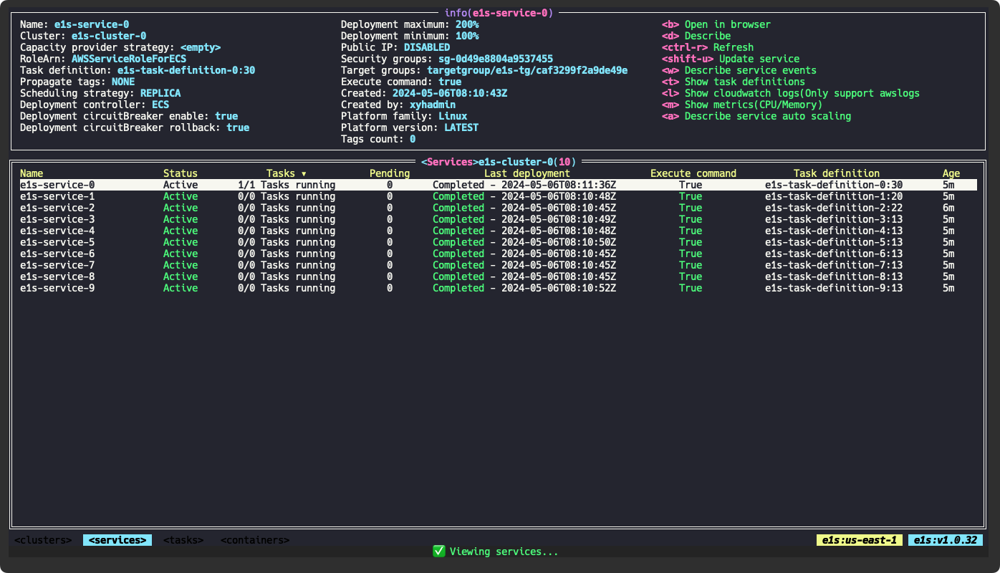
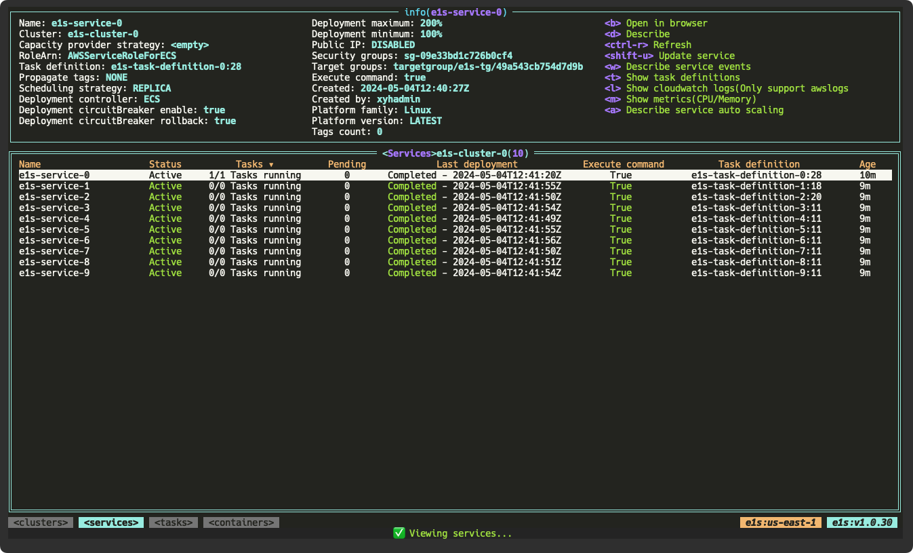
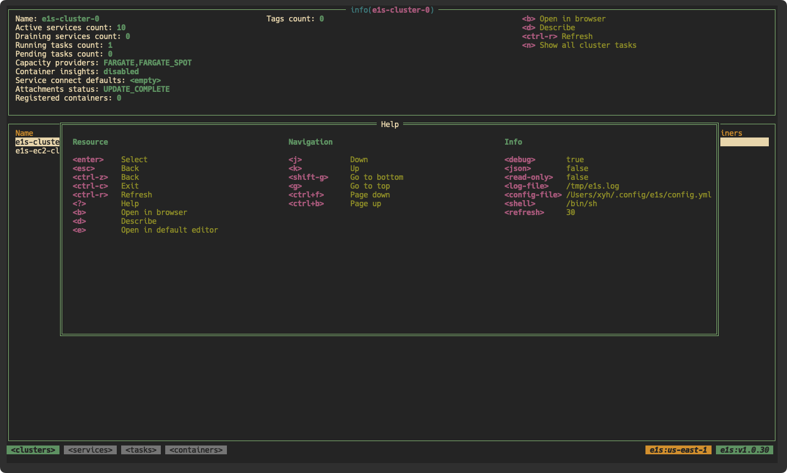
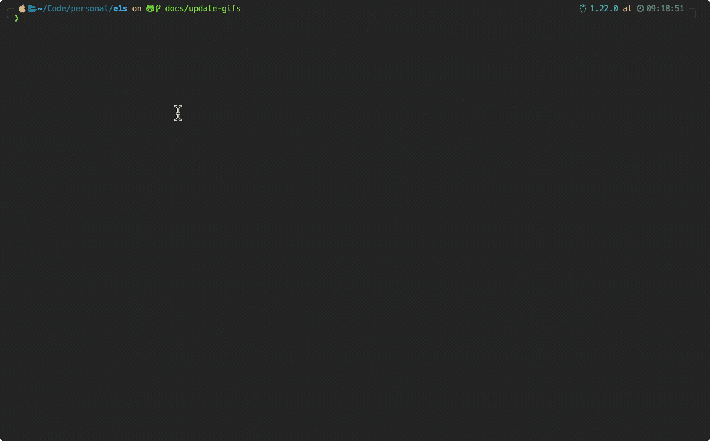
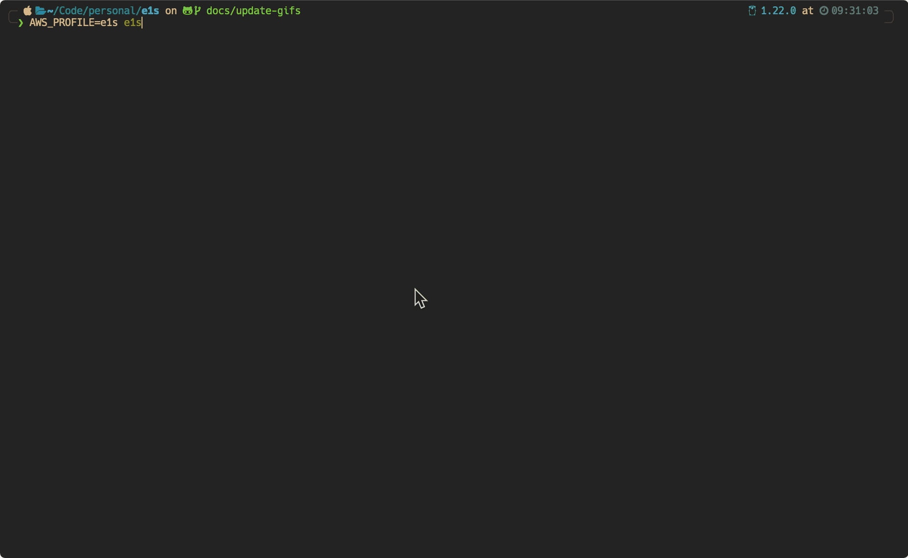
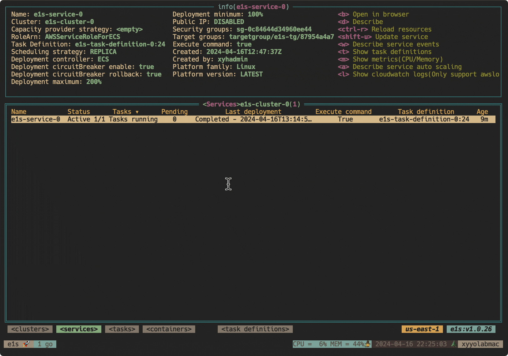
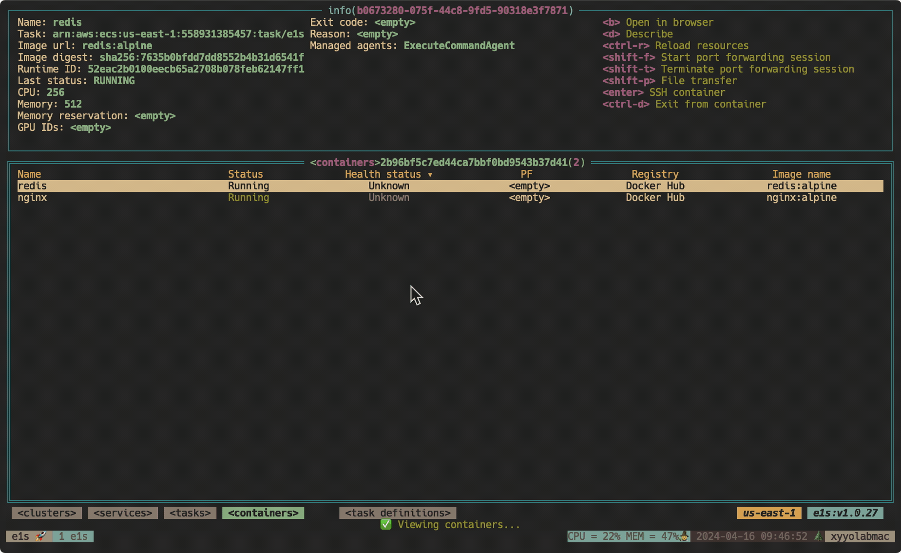
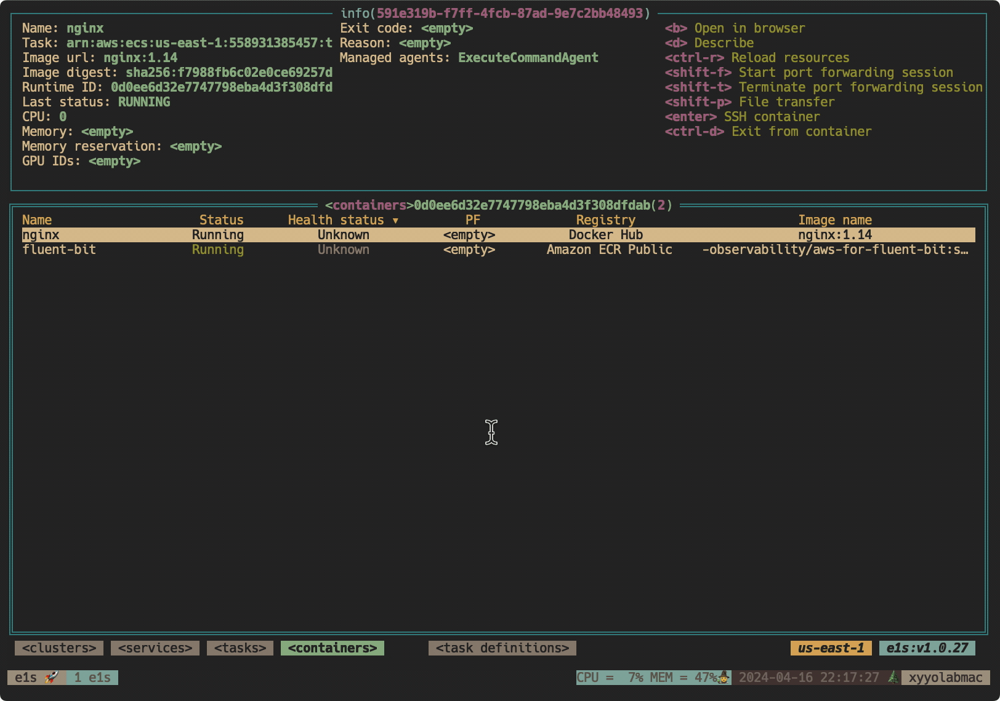

<p align="center">
      
</p>


# E1S - Easily Manage AWS ECS Resources in Terminal 🐱

`e1s` is a terminal application to easily browse and manage AWS ECS resources, supports both [Fargate](https://aws.amazon.com/fargate) and [EC2](https://docs.aws.amazon.com/AmazonECS/latest/developerguide/create-capacity.html) ECS launch types. Inspired by [k9s](https://github.com/derailed/k9s).



<details>
  <summary>A quick video demo</summary>

  
</details>

## AWS credentials and configuration

`e1s` uses the default [aws-cli configuration](https://github.com/aws/aws-cli/blob/develop/README.rst#configuration). It does not store or send your access and secret key anywhere. The access and secret key are used only to securely connect to AWS API via AWS SDK. Both profile and region are overridable via the `AWS_PROFILE`, `AWS_REGION` prepend environment variable or `--profile`, `--region` option.

## Installation

`e1s` is available on Linux, macOS and Windows platforms.

- Binaries for Linux, Windows and Mac are available in the [release](https://github.com/keidarcy/e1s/releases) page.
- Homebrew for maxOS or Linux

```bash
brew install keidarcy/tap/e1s
# brew upgrade
# brew upgrade keidarcy/tap/e1s
```

- Docker image

```bash
# docker image
docker pull ghcr.io/keidarcy/e1s:latest
```

- AWS [CloudShell](https://aws.amazon.com/cloudshell/)(Good for quick tryout)

```bash
curl -sL https://raw.githubusercontent.com/keidarcy/e1s-install/master/cloudshell-install.sh | bash
```

- go install command

```bash
go install github.com/keidarcy/e1s/cmd/e1s@latest
```

## Usage

Make sure you have the AWS CLI installed and properly configured with the necessary permissions to access your ECS resources, and [session manager plugin](https://docs.aws.amazon.com/systems-manager/latest/userguide/session-manager-working-with-install-plugin.html) installed if you want to use the interactive exec or port forwarding features.

- Usage of `e1s`:

```
$ e1s -h
e1s is a terminal application to easily browse and manage AWS ECS resources 🐱.
Check https://github.com/keidarcy/e1s for more details.

Usage:
  e1s [flags]

Flags:
      --cluster string       specify the default cluster
  -c, --config-file string   config file (default "$HOME/.config/e1s/config.yml")
  -d, --debug                sets debug mode
  -h, --help                 help for e1s
  -j, --json                 log output json format
  -l, --log-file string      specify the log file path (default "${TMPDIR}e1s.log")
      --profile string       specify the AWS profile
      --read-only            sets read only mode
  -r, --refresh int          specify the default refresh rate as an integer, sets -1 to stop auto refresh (sec) (default 30)
      --region string        specify the AWS region
  -s, --shell string         specify interactive ecs exec shell (default "/bin/sh")
      --theme string         specify color theme
  -v, --version              version for e1s

```

- Examples

```bash
# use all default config
$ e1s
# use custom-profile profile, us-east-2 region
$ AWS_PROFILE=custom-profile AWS_REGION=us-east-2 e1s
# use custom-profile profile, us-east-2 region
$ e1s --profile custom-profile --region us-east-2
# use command line to set read only, debug, stop auto refresh with a custom log path json output and dracula theme
$ e1s --readonly --debug --refresh -1 --log-file /tmp/e1s.log --json --theme dracula
# docker run with specified profile and region
$ docker run -it --rm -v $HOME/.aws:/root/.aws ghcr.io/keidarcy/e1s:latest e1s --profile YOUR_PROFILE --region YOUR_REGION
```

### Config file([sample](https://github.com/keidarcy/dotfiles/blob/master/other-dot-config/.config/e1s/config.yml))

Default config file path is `$HOME/.config/e1s/config.yml`, it's possible specify the config file that [viper](https://github.com/spf13/viper?tab=readme-ov-file#what-is-viper) supports with `--config-file` option.

### Theme and colors

Theme and colors can be specified by options or config file. Full themes list can be found [here](https://github.com/keidarcy/alacritty-theme/tree/master/themes). If you prefer to use your own color theme, you can specify the colors in the [config file](https://github.com/keidarcy/dotfiles/blob/master/other-dot-config/.config/e1s/config.yml).

<details>
  <summary>examples</summary>

  - command `e1s --theme dracula`
  - screenshot

  

  - config file

```yml
colors:
  BgColor: "#272822"
  FgColor: "#f8f8f2"
  BorderColor: "#a1efe4"
  Black: "#272822"
  Red: "#f92672"
  Green: "#a6e22e"
  Yellow: "#f4bf75"
  Blue: "#66d9ef"
  Magenta: "#ae81ff"
  Cyan: "#a1efe4"
  Gray: "#808080"
```

  - screenshot

  

  - config file

```yml
colors:
  BgColor: black
  FgColor: cadeblue
  BorderColor: dodgerblue
  Black: black
  Red: orangered
  Green: palegreen
  Yellow: greenyellow
  Blue: darkslateblue
  Magenta: mediumpurple
  Cyan: lightskyblue
  Gray: lightslategray
```

  - screenshot

  
</details>

### Key bindings

Press `?` to check overall key bindings, `/` to search in table, top right corner to check current resource specific hot keys.

<details>
  <summary>help</summary>

  
</details>

### Development

```bash
go run cmd/e1s/main.go --debug --log-file /tmp/e1s.log
```

```bash
tail -f /tmp/e1s.log
```

## Features

### Full features list

<details>
  <summary>features</summary>

  - [x] Specify config file
  - [x] Specify the default cluster
  - [x] Read only mode
  - [x] Auto refresh
  - [x] Describe clusters
  - [x] Describe services
  - [x] Describe tasks(running, stopped)
  - [x] Describe containers
  - [x] Describe task definitions
  - [x] Describe service autoscaling
  - [x] Show cloudwatch logs(only support awslogs logDriver)
    - [x] Realtime log streaming(only support one log group)
  - [x] Show Metrics
    - [x] CPUUtilization
    - [x] MemoryUtilization
  - [x] Show autoscaling target and policy
  - [x] Open selected resource in browser(support new UI(v2))
  - [x] Interactively exec towards containers(like ssh)
  - [x] Edit service
    - [x] Desired count
    - [x] Force new deployment
    - [x] Task definition family
    - [x] Task definition revision
  - [x] Stop task
  - [x] Register new task definition
  - [x] Start port forwarding session
  - [x] Start remote host port forwarding session
  - [x] Transfer files to and from your local machine and a remote host like `aws s3 cp`
  - [x] Customize theme
  - [x] Customize colors
</details>


### Interactively exec towards containers([ECS Exec](https://docs.aws.amazon.com/AmazonECS/latest/userguide/ecs-exec.html))

Use [aws-ecs-exec-checker](https://github.com/aws-containers/amazon-ecs-exec-checker) to check for the pre-requisites to use ECS exec.

<details>
  <summary>interactive exec demo</summary>

  
</details>

Use `ctrl` + `d` to exit interactive-exec session.

#### Troubleshooting

*The execute command failed because execute command...* - check [service execute command](https://github.com/keidarcy/e1s/blob/c9587a0bd89eacc08a1fd392523f518309e2437f/tests/ecs.tf#L102), [task role policy](https://github.com/keidarcy/e1s/blob/c9587a0bd89eacc08a1fd392523f518309e2437f/tests/ecs.tf#L157-L168)

*Session Manager plugin not found* - [document](https://docs.aws.amazon.com/systems-manager/latest/userguide/session-manager-troubleshooting.html#plugin-not-found).

### [Update service](https://docs.aws.amazon.com/AmazonECS/latest/APIReference/API_UpdateService.html)

<details>
  <summary>update service demo</summary>

  
</details>

- Force new deployment
- Desired tasks
- Task definition family
- Task definition revision

### [Register task definition](https://docs.aws.amazon.com/AmazonECS/latest/APIReference/API_RegisterTaskDefinition.html)

<details>
  <summary>Register task definition</summary>

  
</details>


### [Start port forwarding session](https://docs.aws.amazon.com/systems-manager/latest/userguide/session-manager-working-with-sessions-start.html#sessions-start-port-forwarding)

With a specified task and container, to start port forwarding session you need to specify a port and a local port. The local port is the port on your local machine that you want to use to access the container port.

<details>
  <summary>Port forwarding session</summary>

  
</details>

### [Start remote host port forwarding session](https://docs.aws.amazon.com/systems-manager/latest/userguide/session-manager-working-with-sessions-start.html#sessions-remote-port-forwarding)

With a specified task and container, to start a remote host port forwarding session you need to specify a port, a host and a local port. The local port is the port on your local machine that you want to use to access the remote host port though container.

<details>
  <summary>Remote host port forwarding session</summary>

  
</details>

### File transfer

Implemented by a S3 bucket. Since file transfer though a S3 bucket and aws-cli in container, you need a S3 bucket and add permissions S3 bucket permission to the task role and e1s role, and also need a aws-cli installed container.

<details>
  <summary>File transfer</summary>

  
</details>

## Feature requests & bug reports

If you have any feature requests or bug reports, please submit them through GitHub [Issues](https://github.com/keidarcy/e1s/issues).

## Publish new version

- Bump version
- `make tag`

## Contact & Author

Xing Yahao(https://github.com/keidarcy)

## Thanks

- [tview](https://github.com/rivo/tview)
- [k9s](https://github.com/derailed/k9s)
- [ecsview](https://github.com/swartzrock/ecsview)

## Stargazers over time

[](https://starchart.cc/keidarcy/e1s)
