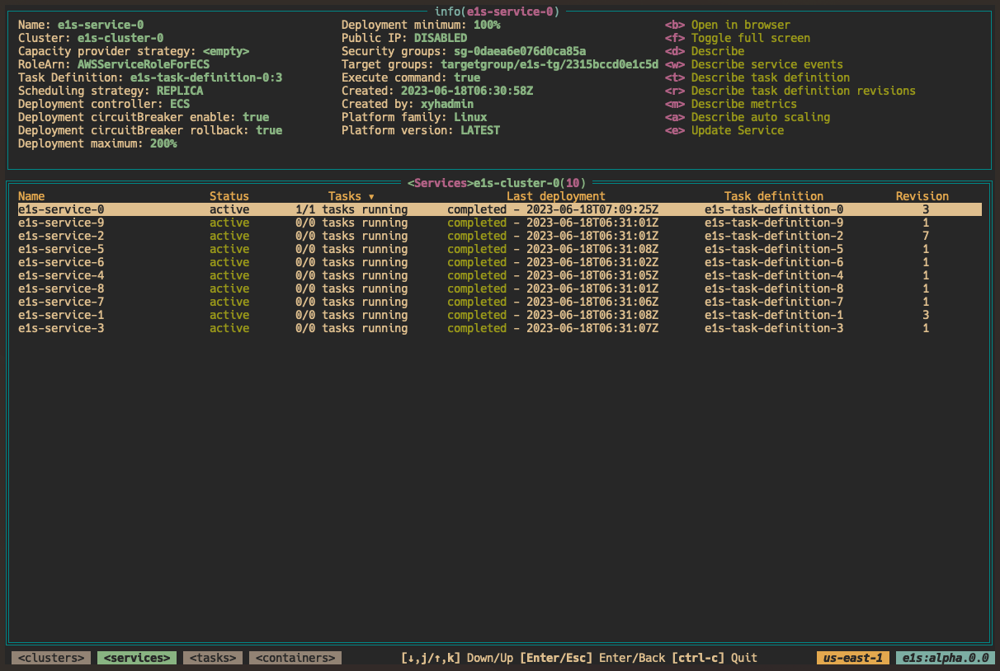
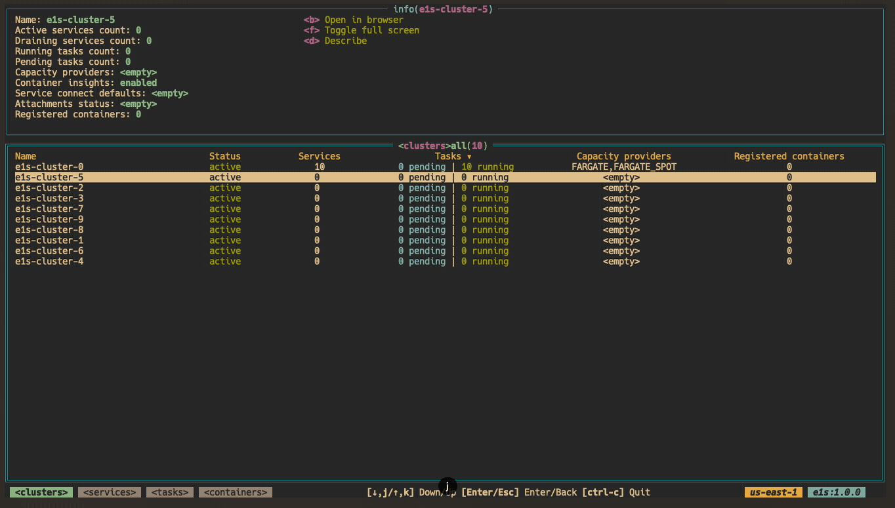
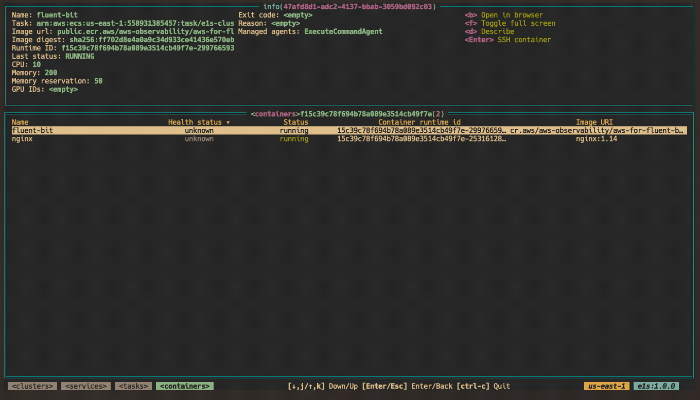
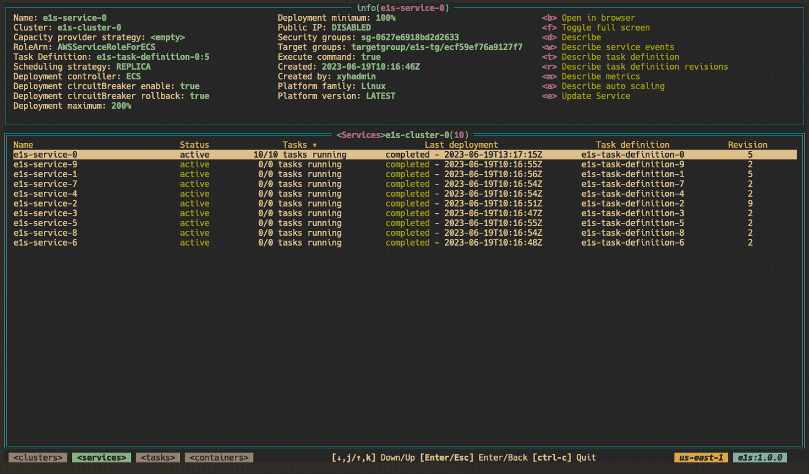

# e1s: ECS In Terminal

`e1s` is a terminal application to easily browsing and manage AWS ECS resources 🐱, with a focus on [Fargate](https://aws.amazon.com/fargate). Inspired by [k9s](https://github.com/derailed/k9s).



<details>
  <summary>demo</summary>

  
</details>


## Installation

e1s is available on Linux, macOS and Windows platforms.

- Binaries for Linux, Windows and Mac are available in the [release](https://github.com/keidarcy/e1s/releases) page.
- Via Homebrew for maxOS or Linux

```bash
brew install keidarcy/tap/e1s
```

## Features

### Basic

- [x] Read only mode
- [x] Describe clusters
- [x] Describe services
- [x] Describe tasks
- [x] Describe containers
- [x] Describe task definitions
- [x] Describe service autoscaling
- [x] Describe Metrics
  - [x] CPUUtilization
  - [x] MemoryUtilization
- [x] Open selected resource in browser(support new UI(v2))
- [x] SSH into container
- [x] Edit service
  - [x] Desired count
  - [x] Task definition(choose revision of current task definition family)
  - [x] Force new deployment
  - [ ] Task definition(choose task definition family and revision)
- [ ] Edit autoscaling
- [ ] Edit task definition
- [ ] Execute any command in container

### SSH into container ([ECS Exec](https://docs.aws.amazon.com/AmazonECS/latest/userguide/ecs-exec.html))

<details>
  <summary>ssh demo</summary>

  
</details>


If you experience any issue with ssh, please check [documents](https://docs.aws.amazon.com/AmazonECS/latest/developerguide/ecs-exec.html#ecs-exec-enabling) and [aws-ecs-exec-checker](https://github.com/aws-containers/amazon-ecs-exec-checker).

Use `ctrl` + `d` to end ssh session.

> tips: check [task role policy](https://github.com/keidarcy/e1s/blob/master/tests/ecs.tf#L157-L168)

### Edit service([Docs](https://docs.aws.amazon.com/AmazonECS/latest/APIReference/API_UpdateService.html))

<details>
  <summary>edit service demo</summary>

  
</details>

- Desired count: Desired count of service
- Task definition: Task definition of service(change revision of current task definition family)
- Force new deployment: Force new deployment of service

## Usage

### Run `e1s`

Make sure you have the AWS CLI installed and properly configured with the necessary permissions to access your ECS resources.

Using default profile

```bash
$ e1s
```

Using my-profile profile

```bash
$ AWS_PROFILE=my-profile e1s
```

read only mode

```bash
$ AWS_PROFILE=my-profile e1s -readonly
```

### Key Bindings

| Key | Description |
| --- | --- |
| `↓`, `j` | Select next item |
| `↑`, `k` | Select previous item |
| `Enter` | Enter current resource/SSH |
| `Esc` | Go to previous view |
| `d` | Describe selected resource |
| `t` | Describe task definition |
| `w` | Describe service events |
| `a` | Describe service auto scaling |
| `m` | Describe service metrics(CPUUtilization/MemoryUtilization) |
| `r` | List task definition revisions |
| `e` | Edit service in modal |
| `b` | Open selected resource in AWS web console |
| `ctrl` + `c` | Quit |
| `ctrl` + `d` | Exit from container |

### Logs

```bash
tail -f /tmp/e1s_debug.log
```

## Note
**e1s reads your ~/.aws/config file, but it does not store or send your access and secret key anywhere. The access and secret key is used only to securely connect to AWS API via AWS SDK.**

## Feature Requests & Bug Reports

If you have any feature requests or bug reports, please submit them through GitHub [Issues](https://github.com/keidarcy/e1s/issues).

## License

MIT
