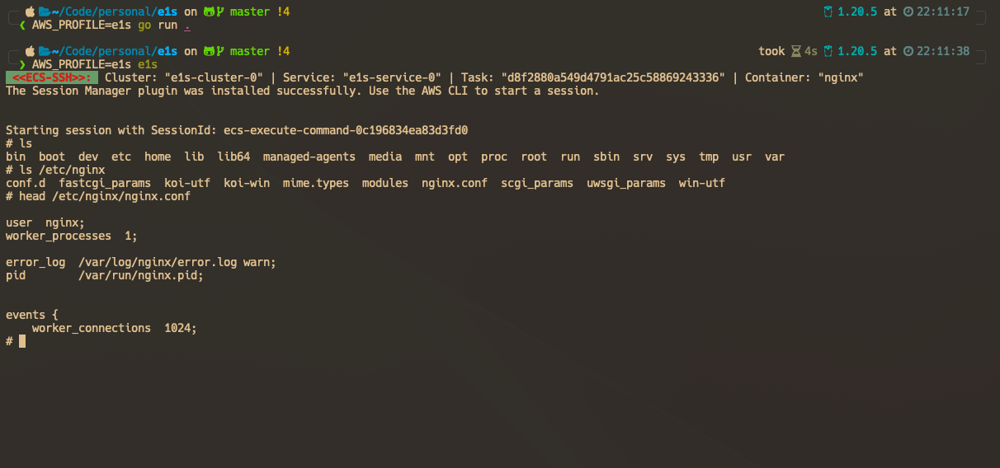

# e1s: ECS In Terminal

`e1s` is a terminal application to easily browsing and manage AWS ECS resources 🐱, with a focus on [Fargate](https://aws.amazon.com/fargate). Inspired by [k9s](https://github.com/derailed/k9s).


<details>
  <summary>Demo</summary>

  
</details>


## Installation

e1s is available on Linux, macOS and Windows platforms.

- Binaries for Linux, Windows and Mac are available in the [release](https://github.com/keidarcy/e1s/releases) page.
- Via Homebrew for maxOS or Linux

```bash
brew install keidarcy/tap/e1s
```

## Usage

### Run `e1s`

Make sure you have the AWS CLI installed and properly configured with the necessary permissions to access your ECS resources.

Using default profile

```bash
$ e1s
```

Using my-profile profile

```bash
$ AWS_PROFILE=my-profile e1s
```

read only mode

```bash
$ AWS_PROFILE=my-profile e1s -readonly
```

### Key Bindings

| Key | Description |
| --- | --- |
| `↓`, `j` | Select next item |
| `↑`, `k` | Select previous item |
| `Enter` | Enter current resource/SSH |
| `Esc` | Go to previous view |
| `d` | Describe selected resource |
| `t` | Describe task definition |
| `r` | List task definition revisions |
| `w` | Describe service events |
| `a` | Describe service auto scaling |
| `m` | Describe service metrics(CPUUtilization/MemoryUtilization) |
| `e` | Update service in modal |
| `b` | Open selected resource in AWS web console(only support new UI(v2)) |
| `ctrl` + `c` | Quit |

### Logs

```bash
tail -f /tmp/e1s_debug.log
```

## Features

### Basic

- [x] List/Describe clusters
- [x] List/Describe services
- [x] List/Describe tasks
- [x] List/Describe containers
- [x] List/Describe task definitions
- [x] Open selected resource in browser
- [x] SSH into container
- [x] Update service
  - [x] Desired count
  - [x] Task definition(choose revision of current task definition family)
  - [x] Force new deployment
  - [ ] Task definition(choose task definition family and revision)
- [x] Describe service autoscaling
- [x] Metrics
  - [x] CPUUtilization
  - [x] MemoryUtilization
- [x] Read only mode

### SSH into container ([ECS Exec](https://docs.aws.amazon.com/AmazonECS/latest/userguide/ecs-exec.html))

If you experience any issue with SSH, please check [documents](https://docs.aws.amazon.com/AmazonECS/latest/developerguide/ecs-exec.html#ecs-exec-enabling) and [aws-ecs-exec-checker](https://github.com/aws-containers/amazon-ecs-exec-checker).



- tips: check [task role policy](https://github.com/keidarcy/e1s/blob/master/tests/ecs.tf#L157-L168)

### Update service([Docs](https://docs.aws.amazon.com/AmazonECS/latest/APIReference/API_UpdateService.html))

- Desired count: Update desired count of service
- Task definition: Update task definition of service(change revision of current task definition family)
- Force new deployment: Force new deployment of service

<details>
  <summary>Demo</summary>

  
</details>

## Feature Requests & Bug Reports

If you have any feature requests or bug reports, please submit them through GitHub [Issues](https://github.com/keidarcy/e1s/issues).

## License