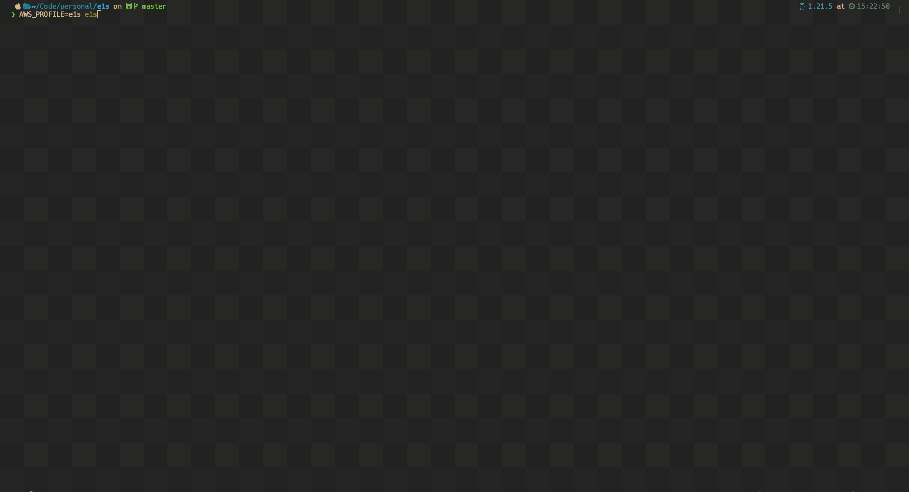

<p align="center">
      
</p>


# E1S - Easily Manage AWS ECS Resources in Terminal 🐱

`e1s` is a terminal application to easily browse and manage AWS ECS resources, with a focus on [Fargate](https://aws.amazon.com/fargate). Inspired by [k9s](https://github.com/derailed/k9s).


## AWS credentials and configuration

`e1s` uses the default [aws-cli configuration](https://github.com/aws/aws-cli/blob/develop/README.rst#configuration). It does not store or send your access and secret key anywhere. The access and secret key are used only to securely connect to AWS API via AWS SDK. Both profile and region are overridable via the `AWS_PROFILE` and `AWS_REGION`.

## Installation

`e1s` is available on Linux, macOS and Windows platforms.

- Binaries for Linux, Windows and Mac are available in the [release](https://github.com/keidarcy/e1s/releases) page.
- Via Homebrew for maxOS or Linux

```bash
brew install keidarcy/tap/e1s
# upgrade
# brew upgrade keidarcy/tap/e1s
```

## Features

### Basic

- [x] Read only mode
- [x] Reload resources
- [x] Describe clusters
- [x] Describe services
- [x] Describe tasks
- [x] Describe containers
- [x] Describe task definitions
- [x] Describe service autoscaling
- [x] Show cloudwatch logs(Only support awslogs logDriver)
  - [x] Realtime log streaming(Only support one log group)
- [x] Show Metrics
  - [x] CPUUtilization
  - [x] MemoryUtilization
- [x] Show autoscaling target and policy
- [x] Open selected resource in browser(Support new UI(v2))
- [x] SSH into container
- [x] Edit service
  - [x] Desired count
  - [x] Force new deployment
  - [x] Task definition family
  - [x] Task definition revision
- [x] Register new task definition

### SSH into container ([ECS Exec](https://docs.aws.amazon.com/AmazonECS/latest/userguide/ecs-exec.html))

Use [aws-ecs-exec-checker](https://github.com/aws-containers/amazon-ecs-exec-checker) to check for the pre-requisites to use ECS exec.

<details>
  <summary>ssh demo</summary>

  
</details>

Use `ctrl` + `d` to exit ssh session.

#### Troubleshooting

*The execute command failed because execute command...* - check [service execute command](https://github.com/keidarcy/e1s/blob/c9587a0bd89eacc08a1fd392523f518309e2437f/tests/ecs.tf#L102), [task role policy](https://github.com/keidarcy/e1s/blob/c9587a0bd89eacc08a1fd392523f518309e2437f/tests/ecs.tf#L157-L168)

*Session Manager plugin not found* - [document](https://docs.aws.amazon.com/systems-manager/latest/userguide/session-manager-troubleshooting.html#plugin-not-found).

### Edit service([Docs](https://docs.aws.amazon.com/AmazonECS/latest/APIReference/API_UpdateService.html))

<details>
  <summary>edit service demo</summary>

  
</details>

- Force new deployment
- Desired tasks
- Task definition family
- Task definition revision

### Register task definition([Docs](https://docs.aws.amazon.com/AmazonECS/latest/APIReference/API_RegisterTaskDefinition.html))

<details>
  <summary>Register task definition</summary>

  
</details>

## Usage

### Run `e1s`


| Option | Description | Default |
| --- | --- | --- |
| `-readonly` | Enable readonly mode | false |
| `-version` | Show e1s version | false |
| `-log-file-path` | The e1s debug log file path | ${TMPDIR}e1s.log |
| `-reload` | Reload data in each move | true |

Make sure you have the AWS CLI installed and properly configured with the necessary permissions to access your ECS resources.

Using default profile

```bash
$ e1s
```

Using my-profile profile, us-east-1 region

```bash
$ AWS_PROFILE=my-profile AWS_REGION=us-east-1 e1s
```

Using read only mode, custom log path, disable reload data

```bash
$ e1s -readonly -log-file-path /tmp/e1s.log -reload false
```

### Key Bindings

| Key | Description |
| --- | --- |
| `↓`, `j`  | Select next item |
| `↑`, `k`  | Select previous item |
| `→`, `Enter` | Enter current resource/SSH |
| `←`, `Esc`, `ctrl` + `z` | Go to previous view |
| `d` | Describe selected resource(show json) |
| `t` | Describe task definition |
| `w` | Describe service events |
| `a` | Show service auto scaling |
| `m` | Show service metrics(CPUUtilization/MemoryUtilization) |
| `l` | Show cloudwatch logs(Only support awslogs logDriver) |
| `r` | Realtime log streaming(Only support one log group) |
| `v` | List task definition revisions |
| `f` | Toggle full screen |
| `e` | Edit resource |
| `b` | Open selected resource in AWS web console |
| `ctrl` + `c` | Quit |
| `ctrl` + `d` | Exit from container |
| `ctrl` + `r` | Reload resources |

### Logs

```bash
tail -f "${TMPDIR}e1s.log"
```

## Feature Requests & Bug Reports

If you have any feature requests or bug reports, please submit them through GitHub [Issues](https://github.com/keidarcy/e1s/issues).

## Publish new version

- Bump version
- `make tag`

## Thanks

- [tview](https://github.com/rivo/tview)
- [k9s](https://github.com/derailed/k9s)
- [ecsview](https://github.com/swartzrock/ecsview)

## License

MIT
