<p align="center">
      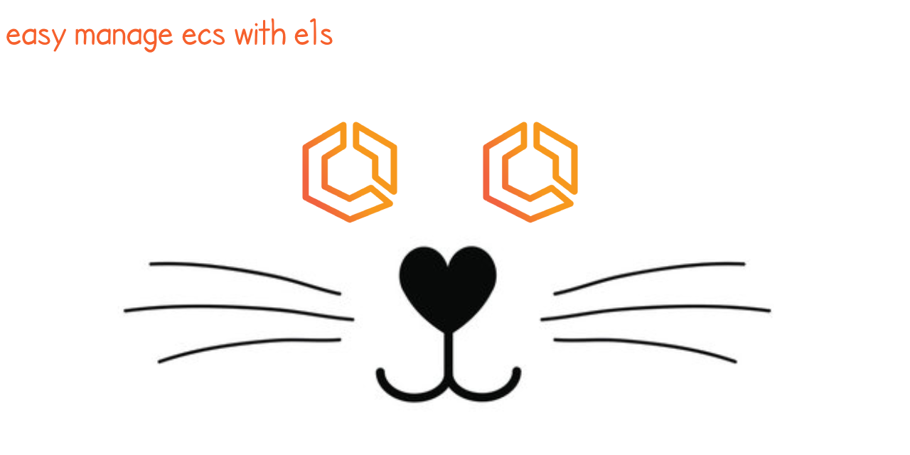
      <a title="This tool is Tool of The Week on Terminal Trove, The $HOME of all things in the terminal" href="https://terminaltrove.com/"></a>
</p>


# E1S - Easily Manage AWS ECS Resources in Terminal 🐱

[](https://ko-fi.com/P5P81HBD07)

`e1s` is a terminal application to easily browse and manage AWS ECS resources, supports both [Fargate](https://aws.amazon.com/fargate) and [EC2](https://docs.aws.amazon.com/AmazonECS/latest/developerguide/create-capacity.html) ECS launch types. Inspired by [k9s](https://github.com/derailed/k9s).


<details>
  <summary>A quick video demo</summary>

  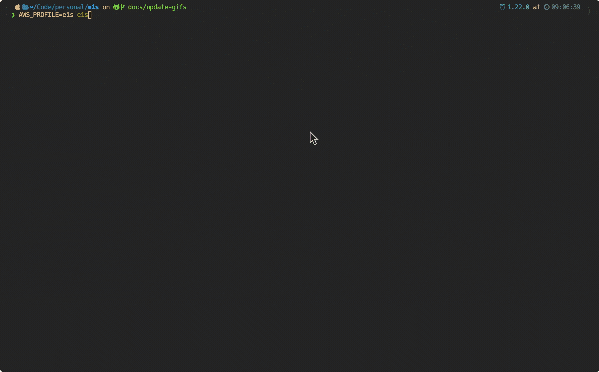
</details>

## AWS credentials and configuration

`e1s` uses the default [aws-cli configuration](https://github.com/aws/aws-cli/blob/develop/README.rst#configuration). It does not store or send your access key or secret key anywhere. Credentials are only used to securely connect to AWS APIs through the AWS SDK for Go.

You can choose AWS credentials and target region in three ways:

- Use your default AWS CLI profile and region.
- Override them at startup with `AWS_PROFILE`, `AWS_REGION`, `--profile`, or `--region`.
- Switch them while `e1s` is running with `Ctrl+P` for profiles and `Ctrl+R` for regions.

`e1s` reads local AWS shared config and credentials files, so it works with common setups such as static credentials, assume-role profiles, `credential_process`, and AWS IAM Identity Center or SSO-based configurations.

## Installation

`e1s` is available on Linux, macOS and Windows platforms.

- Binaries for Linux, Windows and Mac are available in the [release](https://github.com/keidarcy/e1s/releases) page.
- Homebrew for macOS or Linux

```bash
brew install keidarcy/tap/e1s
# brew upgrade
# brew upgrade keidarcy/tap/e1s
```

- Docker image

```bash
# docker image
docker pull ghcr.io/keidarcy/e1s:latest
```

- AWS [CloudShell](https://aws.amazon.com/cloudshell/)(Good for quick tryout)

```bash
curl -sL https://raw.githubusercontent.com/keidarcy/e1s-install/master/cloudshell-install.sh | bash
```

- go install command

```bash
go install github.com/keidarcy/e1s/cmd/e1s@latest
```

- [asdf-vm](https://asdf-vm.com/)

```bash
asdf plugin add e1s
asdf install e1s latest
asdf global e1s latest
```

- [mise](https://github.com/jdx/mise)

```bash
mise install e1s@latest
```

## Usage

Make sure you have the AWS CLI installed and properly configured with the necessary permissions to access your ECS resources, and [session manager plugin](https://docs.aws.amazon.com/systems-manager/latest/userguide/session-manager-working-with-install-plugin.html) installed if you want to use the interactive exec or port forwarding features.

- Usage of `e1s`:

```
$ e1s -h
e1s is a terminal application to easily browse and manage AWS ECS resources 🐱.
Check https://github.com/keidarcy/e1s for more details.

Usage:
  e1s [flags]

Flags:
      --cluster string       specify the default cluster
  -c, --config-file string   config file (default "$HOME/.config/e1s/config.yml")
  -d, --debug                sets debug mode
  -h, --help                 help for e1s
  -j, --json                 log output json format
  -l, --log-file string      specify the log file path (default "${TMPDIR}e1s.log")
      --profile string       specify the AWS profile
      --read-only            sets read only mode
  -r, --refresh int          specify the default refresh rate as an integer, sets -1 to stop auto refresh (sec) (default 30)
      --region string        specify the AWS region
      --service string       specify the default service (requires --cluster)
  -s, --shell string         specify interactive ecs exec shell (default "/bin/sh")
      --splash               display startup splash screen (AWS load runs before the UI) (default true)
      --theme string         specify color theme
  -v, --version              version for e1s

```

- Examples

```bash
# use all default config
$ e1s
# use custom-profile profile, us-east-2 region
$ AWS_PROFILE=custom-profile AWS_REGION=us-east-2 e1s
# use custom-profile profile, us-east-2 region
$ e1s --profile custom-profile --region us-east-2
# use default cluster and default service
$ e1s --cluster cluster-1 --service service-1
# use command line to set read only, debug, stop auto refresh with a custom log path, json output, and dracula theme
$ e1s --read-only --debug --refresh -1 --log-file /tmp/e1s.log --json --theme dracula
# disable the startup splash screen
$ e1s --splash=false
# docker run with specified profile and region
$ docker run -it --rm -v $HOME/.aws:/root/.aws ghcr.io/keidarcy/e1s:latest e1s --profile YOUR_PROFILE --region YOUR_REGION
```

### Config file([sample](https://github.com/keidarcy/dotfiles/blob/master/other-dot-config/.config/e1s/config.yml))

Default config file path is `$HOME/.config/e1s/config.yml`. You can specify a different config file with `--config-file`. Because `e1s` uses [viper](https://github.com/spf13/viper?tab=readme-ov-file#what-is-viper), standard config file formats supported by viper can be used.

Typical settings you may want to manage in config are:

- `theme`
- `refresh`
- `read-only`
- `log-file`
- default `cluster` and `service`
- `splash`
- color overrides

### Theme and colors

Theme and colors can be specified by options or config file. Full themes list can be found [here](https://github.com/keidarcy/alacritty-theme/tree/master/themes). If you prefer to use your own color theme, you can specify the colors in the [config file](https://github.com/keidarcy/dotfiles/blob/master/other-dot-config/.config/e1s/config.yml).

<details>
  <summary>examples</summary>

  - command `e1s --theme dracula`
  - screenshot

  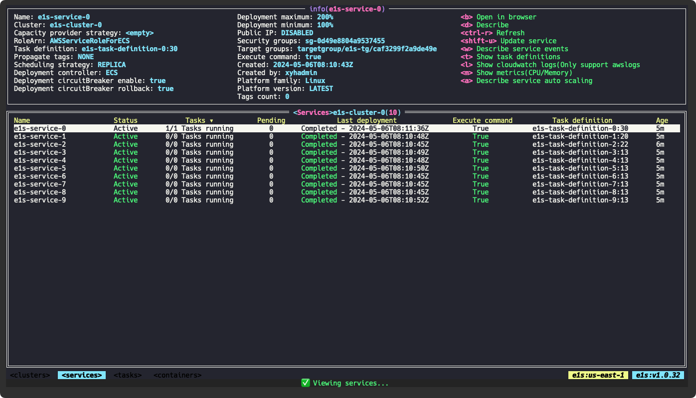

  - config file

```yml
colors:
  BgColor: "#272822"
  FgColor: "#f8f8f2"
  BorderColor: "#a1efe4"
  Black: "#272822"
  Red: "#f92672"
  Green: "#a6e22e"
  Yellow: "#f4bf75"
  Blue: "#66d9ef"
  Magenta: "#ae81ff"
  Cyan: "#a1efe4"
  Gray: "#808080"
```

  - screenshot

  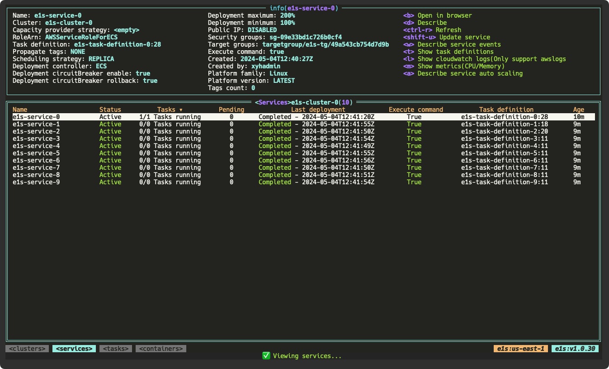

  - config file

```yml
colors:
  BgColor: black
  FgColor: cadeblue
  BorderColor: dodgerblue
  Black: black
  Red: orangered
  Green: palegreen
  Yellow: greenyellow
  Blue: darkslateblue
  Magenta: mediumpurple
  Cyan: lightskyblue
  Gray: lightslategray
```

  - screenshot

  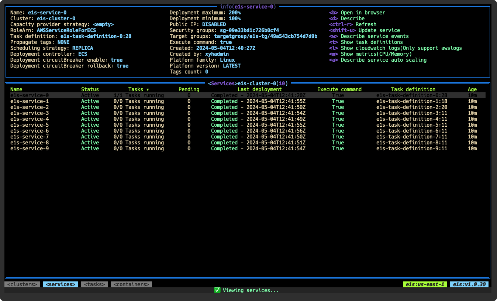
</details>

### Key bindings

`e1s` supports Vim-style navigation: use `h`, `j`, `k`, `l` for left, down, up, right navigation respectively.

Common shortcuts:

- `?` shows the help page.
- `Ctrl+P` opens the AWS profile list.
- `Ctrl+R` opens the AWS region list.
- `/` opens table filtering. Use `ESC` to clear the current filter.
- `F1` to `F12` sort the current table by column.
- `d` opens the description view for the selected resource.
- `b` opens the selected resource in the AWS console.
- `r` refreshes the current view.
- `s` opens shell access on supported task, instance, and container views.

Press `?` to check overall key bindings.

<details>
  <summary>help</summary>

  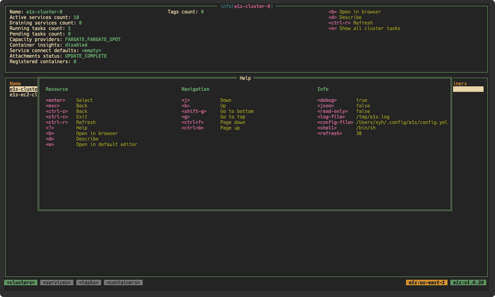
</details>

### Development

```bash
go run cmd/e1s/main.go --debug --log-file /tmp/e1s.log
```

```bash
tail -f /tmp/e1s.log
```

## Features

### Core workflow

- Browse ECS resources in a drill-down flow: clusters -> services -> tasks -> containers.
- Jump directly to a specific cluster or service from the CLI.
- Use the app in read-only mode when you want browsing and inspection without mutation actions.
- Auto-refresh resource lists on a configurable interval.
- Start with a splash screen that loads AWS resources before the main UI is shown.

### Navigation and discovery

- Vim-style navigation with rich keyboard shortcuts.
- Global help page.
- In-table filtering with simple text matching or `column:value` syntax.
- Per-column sorting with function keys.
- Dedicated profile and region views with in-app switching.
- Footer indicators that show the current AWS profile and region context.

### Resource inspection

- Describe clusters.
- Describe EC2 container instances.
- Describe services.
- Describe service deployments.
- Describe service revisions.
- Describe tasks, including running and stopped tasks.
- Describe containers.
- Describe task definitions.
- Describe service autoscaling.
- Open the selected resource in the AWS console.
- View CloudWatch Logs for supported `awslogs` configurations.
- Start realtime log streaming for supported single-log-group cases.
- Show service CPU and memory metrics.

### Resource operations

- ECS Exec style interactive shell into containers.
- Interactive shell into ECS container instances through AWS Systems Manager.
- Update services.
- Roll back service deployments.
- Stop tasks.
- Register new task definitions.
- Start local port forwarding sessions.
- Start remote host port forwarding sessions through a selected container.
- Transfer files through S3-backed workflows.
- Run one-off exec commands in containers.
- Download text file content from containers.

### Customization

- Configure themes from the built-in theme set.
- Override individual colors in config.
- Adjust logging, refresh interval, splash behavior, shell, and default navigation targets.

### Switch AWS profile and region

Press `Ctrl+P` to pick an AWS profile and `Ctrl+R` to pick a region. The footer shows the active profile and region.

<details>
  <summary>Profile and region</summary>

  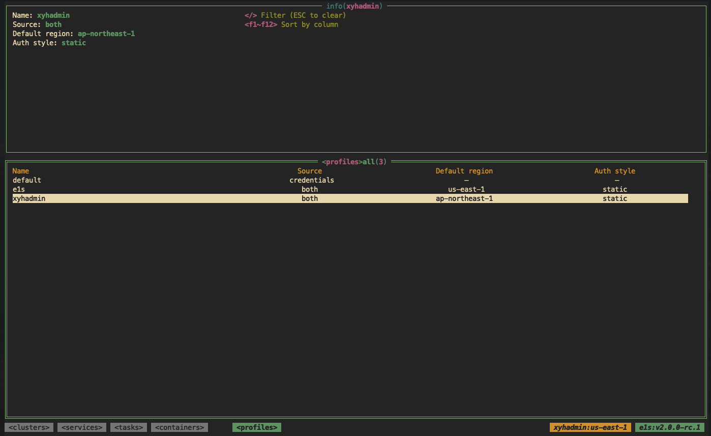

  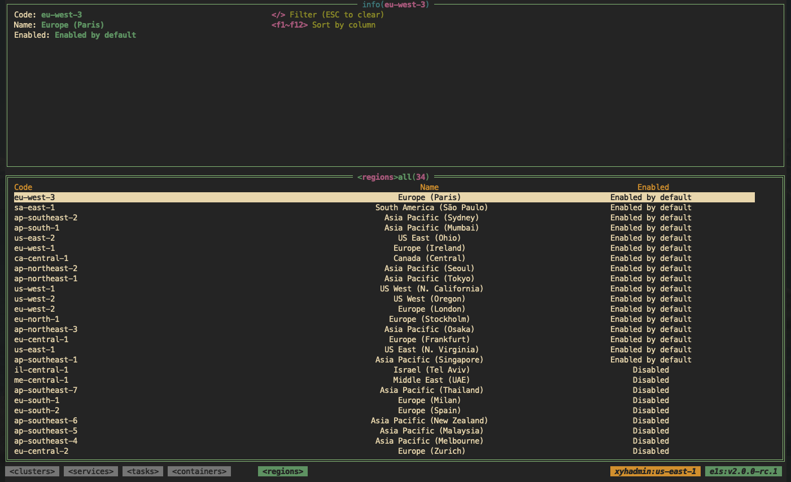
</details>

### Table filtering

Press `/` to filter rows. Use plain text to filter the first column or `column:value` queries (for example `service:1`). Press `ESC` to clear the filter.

<details>
  <summary>Table filtering</summary>

  

  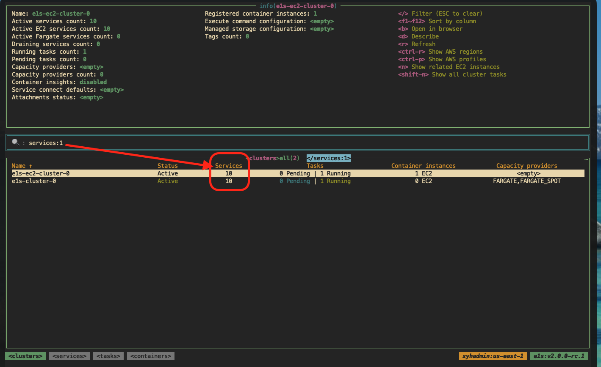
</details>

### Table sorting

Press `F1` through `F12` to sort the current table by that column index.

<details>
  <summary>Table sorting</summary>

  
</details>

### [Service deployments](https://docs.aws.amazon.com/AmazonECS/latest/APIReference/API_ListServiceDeployments.html)

From the service list, press `p` on a service to open its deployments. From there you can inspect a deployment or open the linked service revision.

<details>
  <summary>Service deployments</summary>
  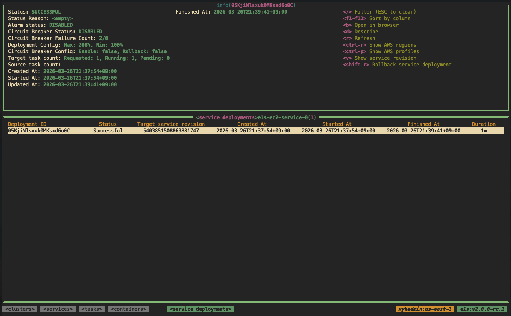
</details>

### Interactively exec towards containers([ECS Exec](https://docs.aws.amazon.com/AmazonECS/latest/userguide/ecs-exec.html))

Use [aws-ecs-exec-checker](https://github.com/aws-containers/amazon-ecs-exec-checker) to check for the pre-requisites to use ECS exec.

<details>
  <summary>interactive exec demo</summary>

  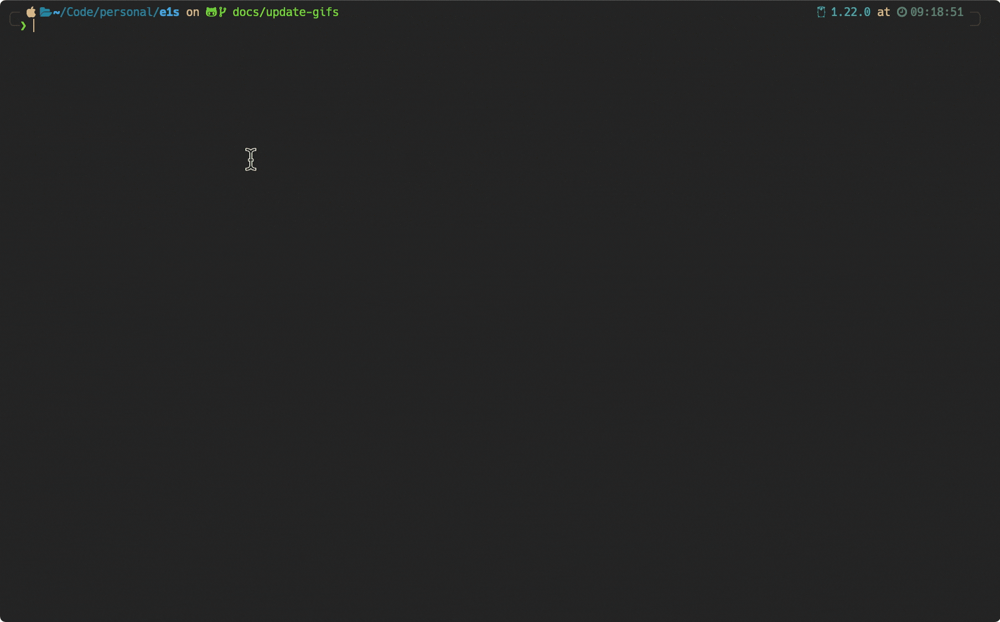
</details>

Use `ctrl` + `d` to exit interactive-exec session.

#### Troubleshooting

*The execute command failed because execute command...* - check [service execute command](https://github.com/keidarcy/e1s/blob/c9587a0bd89eacc08a1fd392523f518309e2437f/tests/ecs.tf#L102), [task role policy](https://github.com/keidarcy/e1s/blob/c9587a0bd89eacc08a1fd392523f518309e2437f/tests/ecs.tf#L157-L168)

*Session Manager plugin not found* - [document](https://docs.aws.amazon.com/systems-manager/latest/userguide/session-manager-troubleshooting.html#plugin-not-found).

### [Update service](https://docs.aws.amazon.com/AmazonECS/latest/APIReference/API_UpdateService.html)

<details>
  <summary>update service demo</summary>

  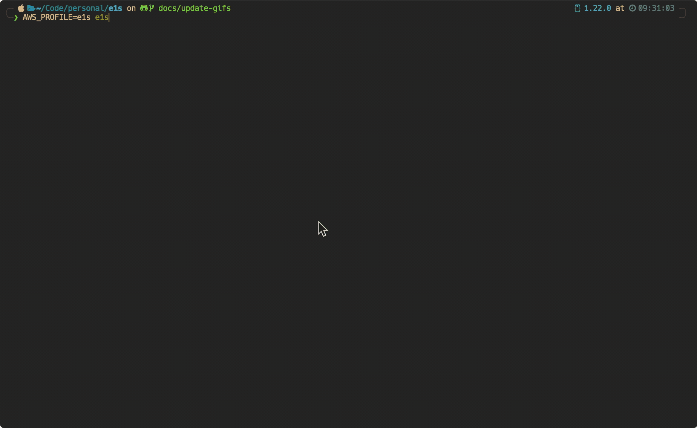
</details>

- Force new deployment
- Desired tasks
- Task definition family
- Task definition revision

### [Register task definition](https://docs.aws.amazon.com/AmazonECS/latest/APIReference/API_RegisterTaskDefinition.html)

<details>
  <summary>Register task definition</summary>

  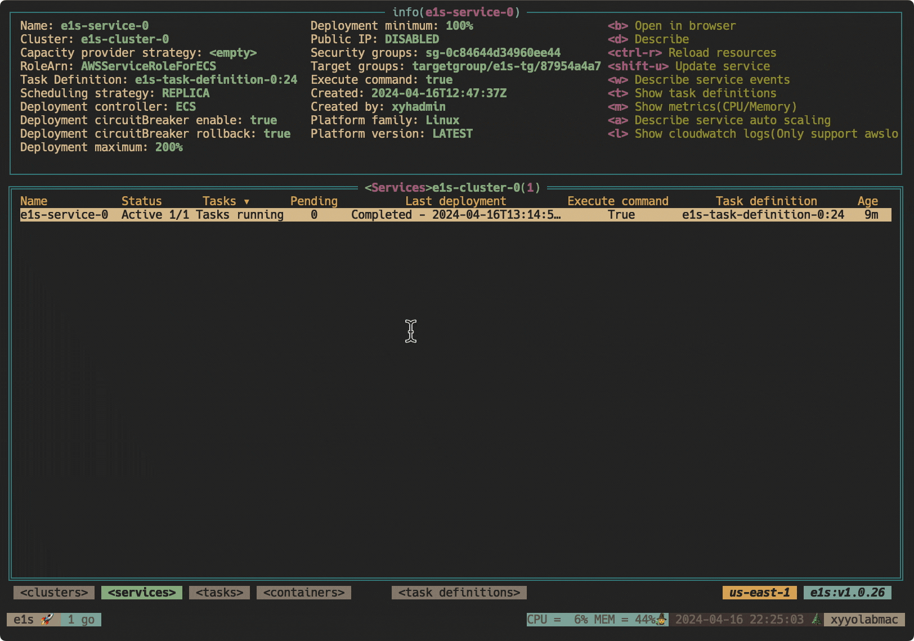
</details>


### [Start port forwarding session](https://docs.aws.amazon.com/systems-manager/latest/userguide/session-manager-working-with-sessions-start.html#sessions-start-port-forwarding)

With a specified task and container, to start port forwarding session you need to specify a port and a local port. The local port is the port on your local machine that you want to use to access the container port.

<details>
  <summary>Port forwarding session</summary>

  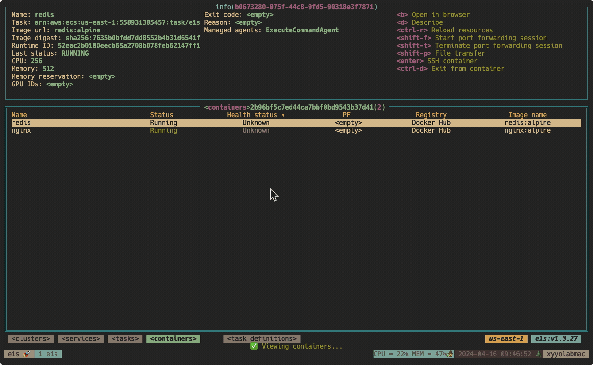
</details>

### [Start remote host port forwarding session](https://docs.aws.amazon.com/systems-manager/latest/userguide/session-manager-working-with-sessions-start.html#sessions-remote-port-forwarding)

With a specified task and container, to start a remote host port forwarding session you need to specify a port, a host and a local port. The local port is the port on your local machine that you want to use to access the remote host port though container.

<details>
  <summary>Remote host port forwarding session</summary>

  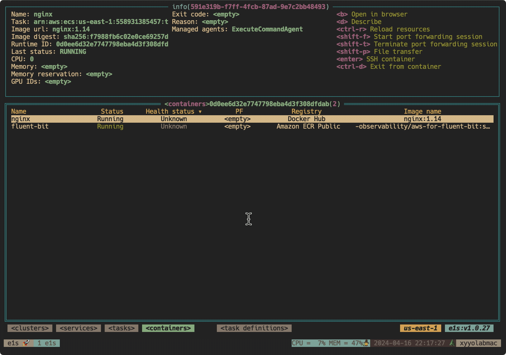
</details>

### File transfer

Implemented by a S3 bucket. Since file transfer though a S3 bucket and aws-cli in container, you need a S3 bucket and add permissions S3 bucket permission to the task role and e1s role, and also need a aws-cli installed container.

<details>
  <summary>File transfer</summary>

  
</details>

### Full features list

<details>
  <summary>features</summary>

  - [x] Specify config file
  - [x] Specify the default cluster
  - [x] Read only mode
  - [x] Auto refresh
  - [x] Describe clusters
  - [x] Describe instances
  - [x] Describe services
  - [x] Describe service deployments
  - [x] Describe service revisions
  - [x] Describe tasks(running, stopped)
  - [x] Describe containers
  - [x] Describe task definitions
  - [x] Describe service autoscaling
  - [x] Show cloudwatch logs(only support awslogs logDriver)
    - [x] Realtime log streaming(only support one log group)
  - [x] Show Metrics
    - [x] CPUUtilization
    - [x] MemoryUtilization
  - [x] Show autoscaling target and policy
  - [x] Open selected resource in browser(support new UI(v2))
  - [x] Interactively shell to containers(like ssh)
  - [x] Interactively shell to instances(like ssh)
  - [x] Switch AWS profiles in-app
  - [x] Switch AWS regions in-app
  - [x] Filter table data
  - [x] Sort table columns
  - [x] Edit service
    - [x] Desired count
    - [x] Force new deployment
    - [x] Task definition family
    - [x] Task definition revision
  - [x] Stop task
  - [x] Register new task definition
  - [x] Start port forwarding session
  - [x] Start remote host port forwarding session
  - [x] Transfer files to and from your local machine and a remote host like `aws s3 cp`
  - [x] Customize theme
  - [x] Customize colors
</details>

## Feature requests & bug reports

If you have any feature requests or bug reports, please submit them through GitHub [Issues](https://github.com/keidarcy/e1s/issues).

## Publish new version

- Bump version
- `make tag`

## Contact & Author

Xing Yahao(https://github.com/keidarcy)

## Thanks

- [tview](https://github.com/rivo/tview)
- [k9s](https://github.com/derailed/k9s)
- [ecsview](https://github.com/swartzrock/ecsview)

## Stargazers over time

[](https://starchart.cc/keidarcy/e1s)

